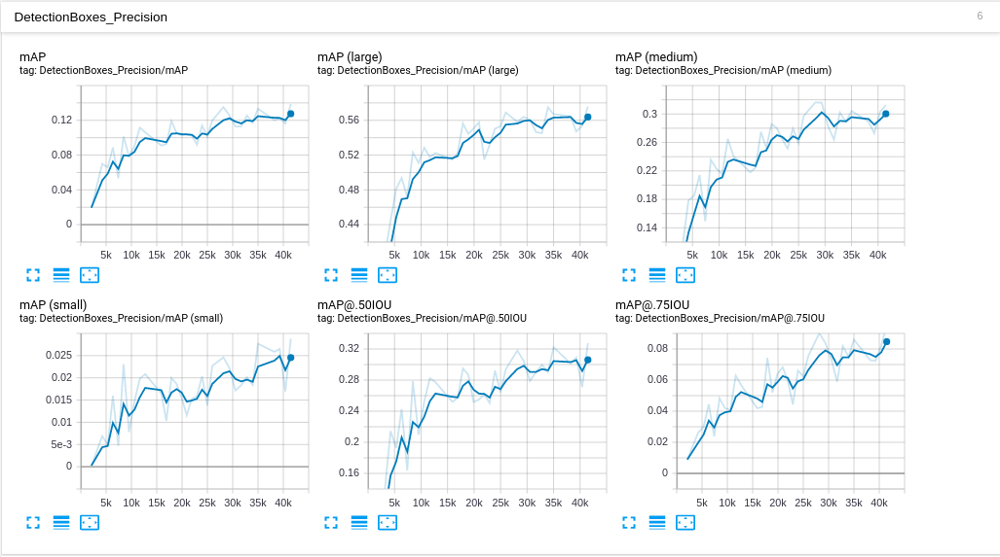
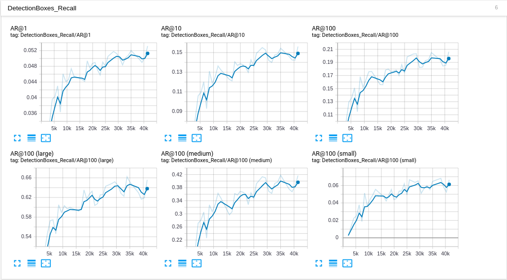
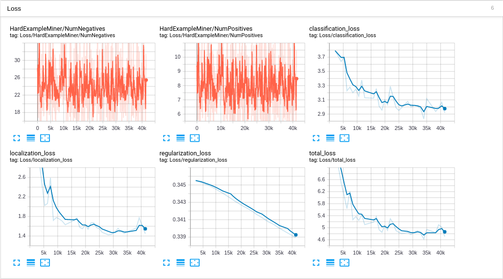

# 학습시키기

## Model 고르기

<a href="https://github.com/tensorflow/models/blob/master/research/object_detection/g3doc/detection_model_zoo.md">Tensorflow detection model zoo</a>의 COCO-trained models 부분에 가면 여러가지 object detection 모델이 있습니다.

여기서는 이 중 ssd_mobilenet_v1_coco라는 모델을 사용하겠습니다. (Wider face dataset을 학습 시킨 후 잘 동작한 model입니다)

tensorflow/model/research/object_detection/ 경로에 해당 모델을 내려받아 압축을 해제합니다. (아래와 같이 하셔도 되고 직접 클릭해서 내려받은 후 해당 경로로 이동시켜도 됩니다)

```bash
# model 내려받기
user@ubuntu:~/tensorflow/models/research/object_detection$ wget http://download.tensorflow.org/models/object_detection/
Saving to: ‘ssd_mobilenet_v1_coco_2018_01_28.tar.gz’

...

ssd_mobilenet_v1_coco_2018 100%[======================================>]  73.00M  34.4MB/s    in 2.1s

2019-09-06 10:17:43 (34.4 MB/s) - ‘ssd_mobilenet_v1_coco_2018_01_28.tar.gz’ saved [76541073/76541073]

# 압축 해제
user@ubuntu:~/tensorflow/models/research/object_detection$ tar -zxvf ./ssd_mobilenet_v1_coco_2018_01_28.tar.gz
ssd_mobilenet_v1_coco_2018_01_28/
ssd_mobilenet_v1_coco_2018_01_28/model.ckpt.index
ssd_mobilenet_v1_coco_2018_01_28/checkpoint
ssd_mobilenet_v1_coco_2018_01_28/pipeline.config
ssd_mobilenet_v1_coco_2018_01_28/model.ckpt.data-00000-of-00001
ssd_mobilenet_v1_coco_2018_01_28/model.ckpt.meta
ssd_mobilenet_v1_coco_2018_01_28/saved_model/
ssd_mobilenet_v1_coco_2018_01_28/saved_model/saved_model.pb
ssd_mobilenet_v1_coco_2018_01_28/saved_model/variables/
ssd_mobilenet_v1_coco_2018_01_28/frozen_inference_graph.pb
user@ubuntu:~/tensorflow/models/research/object_detection$
```

## checkpoint 파일

checkpoint 파일이란 tensorflow로 학습된 모델의 variable 값들이 저장된 파일을 뜻합니다. 따라서, checkpoint 파일을 저장하고 불러옴으로써 학습된 모델을 재사용하고, 지난 학습을 이어서 하는 작업들이 가능해집니다.

여기서는 학습된 모델에 다시 학습을 시키기 때문에 미리 학습이 된 모델의 checkpoint 파일이 필요합니다.

위에서 압축해제한 ssd_mobilenet_v1_coco_2018_01_28 디렉토리 안의 model.ckpt.data-00000-of-00001, model.ckpt.meta, model.ckpt.index 이 세가지 파일이 학습된 checkpoint 파일입니다.

여기서는 ckpt라는 디렉토리를 생성하고 이곳에 위 세 파일을 복사해서 사용하겠습니다. 이후 저희가 학습한 모델도 이곳에 저장하기 위해서입니다.

```bash
user@ubuntu:~/tensorflow/models/research/object_detection$ mkdir ckpt
user@ubuntu:~/tensorflow/models/research/object_detection$ cd ./ckpt
user@ubuntu:~/tensorflow/models/research/object_detection/ckpt$ cp ../ssd_mobilenet_v1_coco_2018_01_28/model.ckpt* .
user@ubuntu:~/tensorflow/models/research/object_detection/ckpt$ ls
model.ckpt.data-00000-of-00001  model.ckpt.index  model.ckpt.meta
```

## label map

앞의 <a href='../dataset'>Dataset 만들기</a>에서 generate_tfrecord.py를 통해 tfrecord를 생성할 때, 30~35번째 줄을 보면 아래와 같이 1을 반환하는 것을 볼 수 있는데 이는 face class의 class id를 1로 주겠다는 뜻입니다.

```
# TO-DO replace this with label map
def class_text_to_int(row_label):
    if row_label == 'face':
        return 1
    else:
        None
```

따라서, 우리가 학습시킬 모델에도 이 class id 정보를 알려 주어야 하며 이 정보를 label map을 통해 알려줍니다.

label map은 주로 \*.pbtxt 파일 형태로 되어있으며, tensorflow/models/research/object_detection/data 경로에 보면 많은 label map 파일들이 있습니다.

```bash
user@ubuntu:~/tensorflow/models/research/object_detection/data$ ls
ava_label_map_v2.1.pbtxt           mscoco_minival_ids.txt
face_label_map.pbtxt               oid_bbox_trainable_label_map.pbtxt
fgvc_2854_classes_label_map.pbtxt  oid_object_detection_challenge_500_label_map.pbtxt
kitti_label_map.pbtxt              oid_v4_label_map.pbtxt
mscoco_complete_label_map.pbtxt    pascal_label_map.pbtxt
mscoco_label_map.pbtxt             pet_label_map.pbtxt
```

여기서는 위 파일들의 형태를 참고해서 label_map.pbtxt 파일을 만들고, 앞의 <a href='../dataset'>Dataset 만들기</a>에서 만든 tfrecord 파일과 함께 datasets라는 디렉토리에 위치시키도록 하겠습니다. (<a href='../dataset'>Dataset 만들기</a>의 datasets 디렉토리와 경로가 다릅니다)

```bash
user@ubuntu:~/tensorflow/models/research/object_detection$ mkdir datasets
user@ubuntu:~/tensorflow/models/research/object_detection$ cd ./datasets
user@ubuntu:~/tensorflow/models/research/object_detection/datasets$ vim label_map.pbtxt
# 여기서 만든 label_map.pbtxt 파일 내용 출력
user@ubuntu:~/tensorflow/models/research/object_detection/datasets$ cat label_map.pbtxt
item {
  id: 1
  name: 'face'
}

user@ubuntu:~/tensorflow/models/research/object_detection/datasets$ ls
label_map.pbtxt
user@ubuntu:~/tensorflow/models/research/object_detection/datasets$ cp ~/datasets/*.record .
user@ubuntu:~/tensorflow/models/research/object_detection/datasets$ ls
label_map.pbtxt  train.record  val.record
```

## config 파일

config 파일은 위에서 위치시킨 checkpoint, label map, tfrecord 파일들의 경로와 학습에 관한 여러 설정을 하는 파일입니다. 이 파일만 있으면 이제 학습을 위한 준비가 끝납니다.

config 파일은 다음과 같이 tensorflowAPI/models/research/object_detection/samples/configs 경로에 <a href="https://github.com/tensorflow/models/blob/master/research/object_detection/g3doc/detection_model_zoo.md">Tensorflow detection model zoo</a>의 각 모델별로 존재합니다.

```bash
user@ubuntu:~/tensorflowAPI/models/research/object_detection/samples/configs$ ls
embedded_ssd_mobilenet_v1_coco.config
facessd_mobilenet_v2_quantized_320x320_open_image_v4.config
faster_rcnn_inception_resnet_v2_atrous_coco.config
faster_rcnn_inception_resnet_v2_atrous_cosine_lr_coco.config
faster_rcnn_inception_resnet_v2_atrous_oid.config
faster_rcnn_inception_resnet_v2_atrous_oid_v4.config
faster_rcnn_inception_resnet_v2_atrous_pets.config
faster_rcnn_inception_v2_coco.config
faster_rcnn_inception_v2_pets.config
faster_rcnn_nas_coco.config
faster_rcnn_resnet101_atrous_coco.config
faster_rcnn_resnet101_ava_v2.1.config
faster_rcnn_resnet101_coco.config
faster_rcnn_resnet101_fgvc.config
faster_rcnn_resnet101_kitti.config
faster_rcnn_resnet101_pets.config
faster_rcnn_resnet101_voc07.config
faster_rcnn_resnet152_coco.config
faster_rcnn_resnet152_pets.config
faster_rcnn_resnet50_coco.config
faster_rcnn_resnet50_fgvc.config
faster_rcnn_resnet50_pets.config
mask_rcnn_inception_resnet_v2_atrous_coco.config
mask_rcnn_inception_v2_coco.config
mask_rcnn_resnet101_atrous_coco.config
mask_rcnn_resnet101_pets.config
mask_rcnn_resnet50_atrous_coco.config
rfcn_resnet101_coco.config
rfcn_resnet101_pets.config
ssd_inception_v2_coco.config
ssd_inception_v2_pets.config
ssd_inception_v3_pets.config
ssdlite_mobilenet_v1_coco.config
ssdlite_mobilenet_v2_coco.config
ssd_mobilenet_v1_0.75_depth_300x300_coco14_sync.config
ssd_mobilenet_v1_0.75_depth_quantized_300x300_coco14_sync.config
ssd_mobilenet_v1_0.75_depth_quantized_300x300_pets_sync.config
ssd_mobilenet_v1_300x300_coco14_sync.config
ssd_mobilenet_v1_coco.config
ssd_mobilenet_v1_focal_loss_pets.config
ssd_mobilenet_v1_focal_loss_pets_inference.config
ssd_mobilenet_v1_fpn_shared_box_predictor_640x640_coco14_sync.config
ssd_mobilenet_v1_pets.config
ssd_mobilenet_v1_ppn_shared_box_predictor_300x300_coco14_sync.config
ssd_mobilenet_v1_quantized_300x300_coco14_sync.config
ssd_mobilenet_v2_coco.config
ssd_mobilenet_v2_fpnlite_quantized_shared_box_predictor_256x256_depthmultiplier_75_coco14_sync.config
ssd_mobilenet_v2_fullyconv_coco.config
ssd_mobilenet_v2_oid_v4.config
ssd_mobilenet_v2_pets_keras.config
ssd_mobilenet_v2_quantized_300x300_coco.config
ssd_resnet101_v1_fpn_shared_box_predictor_oid_512x512_sync.config
ssd_resnet50_v1_fpn_shared_box_predictor_640x640_coco14_sync.config
```

여기서는 학습에 사용할 모델(ssd_mobilenet_v1)에 해당하는 ssd_mobilenet_v1_coco.config를 ckpt 디렉토리에 복사한 후 수정해서 사용하도록 하겠습니다.

```bash
user@ubuntu:~/tensorflowAPI/models/research/object_detection/ckpt$ cp ../samples/configs/ssd_mobilenet_v1_coco.config .
user@ubuntu:~/tensorflowAPI/models/research/object_detection/ckpt$ ls
model.ckpt.data-00000-of-00001  model.ckpt.index  model.ckpt.meta  ssd_mobilenet_v1_coco.config
```

ssd_mobilenet_v1_coco.config 파일 내용 중 수정해야 할 부분과 설명은 다음과 같습니다.

- 9번째 줄의 num_classes : 학습 시킬 Object의 class 수
- 156번째 줄의 fine_tune_checkpoint : checkpoint 파일 경로
- 175번째 줄의 input_path : training에 사용할 tfrecord 파일 경로
- 189번째 줄의 input_path : evaluation에 사용할 tfrecord 파일 경로
- 177번째 줄의 label_map_path : training에 사용할 label map 파일 경로
- 191번째 줄의 label_map_path : evaluation에 사용할 label map 파일 경로
- 181번째 줄의 num_examples : evaluation data의 수

따라서, 이들을 다음과 같이 수정합니다.

- 9번째 줄의 num_classes: 1
- 156번째 줄의 fine_tune_checkpoint: "ckpt/model.ckpt"
- 175번째 줄의 input_path: "datasets/train.record"
- 189번째 줄의 input_path: "datasets/val.record"
- 177번째 줄의 label_map_path: "datasets/label_map.pbtxt"
- 191번째 줄의 label_map_path: "datasets/label_map.pbtxt"
- 181번째 줄의 num_examples : 3226

수정한 결과는 다음과 같습니다.

```bash
user@ubuntu:~/tensorflow/models/research/object_detection/ckpt$ cat ssd_mobilenet_v1_coco.config
# SSD with Mobilenet v1 configuration for MSCOCO Dataset.
# Users should configure the fine_tune_checkpoint field in the train config as
# well as the label_map_path and input_path fields in the train_input_reader and
# eval_input_reader. Search for "PATH_TO_BE_CONFIGURED" to find the fields that
# should be configured.

model {
  ssd {
    num_classes: 1
    box_coder {
      faster_rcnn_box_coder {
        y_scale: 10.0
        x_scale: 10.0
        height_scale: 5.0
        width_scale: 5.0
      }
    }
    matcher {
      argmax_matcher {
        matched_threshold: 0.5
        unmatched_threshold: 0.5
        ignore_thresholds: false
        negatives_lower_than_unmatched: true
        force_match_for_each_row: true
      }
    }
    similarity_calculator {
      iou_similarity {
      }
    }
    anchor_generator {
      ssd_anchor_generator {
        num_layers: 6
        min_scale: 0.2
        max_scale: 0.95
        aspect_ratios: 1.0
        aspect_ratios: 2.0
        aspect_ratios: 0.5
        aspect_ratios: 3.0
        aspect_ratios: 0.3333
      }
    }
    image_resizer {
      fixed_shape_resizer {
        height: 300
        width: 300
      }
    }
    box_predictor {
      convolutional_box_predictor {
        min_depth: 0
        max_depth: 0
        num_layers_before_predictor: 0
        use_dropout: false
        dropout_keep_probability: 0.8
        kernel_size: 1
        box_code_size: 4
        apply_sigmoid_to_scores: false
        conv_hyperparams {
          activation: RELU_6,
          regularizer {
            l2_regularizer {
              weight: 0.00004
            }
          }
          initializer {
            truncated_normal_initializer {
              stddev: 0.03
              mean: 0.0
            }
          }
          batch_norm {
            train: true,
            scale: true,
            center: true,
            decay: 0.9997,
            epsilon: 0.001,
          }
        }
      }
    }
    feature_extractor {
      type: 'ssd_mobilenet_v1'
      min_depth: 16
      depth_multiplier: 1.0
      conv_hyperparams {
        activation: RELU_6,
        regularizer {
          l2_regularizer {
            weight: 0.00004
          }
        }
        initializer {
          truncated_normal_initializer {
            stddev: 0.03
            mean: 0.0
          }
        }
        batch_norm {
          train: true,
          scale: true,
          center: true,
          decay: 0.9997,
          epsilon: 0.001,
        }
      }
    }
    loss {
      classification_loss {
        weighted_sigmoid {
        }
      }
      localization_loss {
        weighted_smooth_l1 {
        }
      }
      hard_example_miner {
        num_hard_examples: 3000
        iou_threshold: 0.99
        loss_type: CLASSIFICATION
        max_negatives_per_positive: 3
        min_negatives_per_image: 0
      }
      classification_weight: 1.0
      localization_weight: 1.0
    }
    normalize_loss_by_num_matches: true
    post_processing {
      batch_non_max_suppression {
        score_threshold: 1e-8
        iou_threshold: 0.6
        max_detections_per_class: 100
        max_total_detections: 100
      }
      score_converter: SIGMOID
    }
  }
}

train_config: {
  batch_size: 24
  optimizer {
    rms_prop_optimizer: {
      learning_rate: {
        exponential_decay_learning_rate {
          initial_learning_rate: 0.004
          decay_steps: 800720
          decay_factor: 0.95
        }
      }
      momentum_optimizer_value: 0.9
      decay: 0.9
      epsilon: 1.0
    }
  }
  fine_tune_checkpoint: "ckpt/model.ckpt"
  from_detection_checkpoint: true
  # Note: The below line limits the training process to 200K steps, which we
  # empirically found to be sufficient enough to train the pets dataset. This
  # effectively bypasses the learning rate schedule (the learning rate will
  # never decay). Remove the below line to train indefinitely.
  num_steps: 200000
  data_augmentation_options {
    random_horizontal_flip {
    }
  }
  data_augmentation_options {
    ssd_random_crop {
    }
  }
}

train_input_reader: {
  tf_record_input_reader {
    input_path: "datasets/train.record"
  }
  label_map_path: "datasets/label_map.pbtxt"
}

eval_config: {
  num_examples: 3226
  # Note: The below line limits the evaluation process to 10 evaluations.
  # Remove the below line to evaluate indefinitely.
  max_evals: 10
}

eval_input_reader: {
  tf_record_input_reader {
    input_path: "datasets/val.record"
  }
  label_map_path: "datasets/label_map.pbtxt"
  shuffle: false
  num_readers: 1
}
```

## 학습 시키기

학습은 tensorflow/models/research/object_detection 경로의 model_main.py를 통해 다음과 같이 모델 위치(model_dir), config 파일(pipeline_config_path) 등을 인자로 넘겨주며 이루어집니다.

위의 config 파일의 num_steps에 따라 200000번의 step동안 학습이 진행되지만 너무 오랜시간이 걸리기에 여기서는 41471 step에서 ctrl+c를 눌러 학습을 멈추고 41471 checkpoint로 이후 과정을 진행하겠습니다. (이정도까지만 학습을 시켜도 테스트해보니 얼굴 인식이 잘 되었습니다.)

```bash
user@ubuntu:~/tensorflow/models/research/object_detection$ python model_main.py --model_dir=ckpt/ --pipeline_config_path=ckpt/ssd_mobilenet_v1_coco.config --alsologtostderr

...

I0907 02:36:44.227843 139696836876096 session_manager.py:500] Running local_init_op.
I0907 02:36:44.322974 139696836876096 session_manager.py:502] Done running local_init_op.
I0907 02:40:17.196042 139688618739456 coco_evaluation.py:205] Performing evaluation on 3226 images.
creating index...
index created!
I0907 02:40:17.219930 139688618739456 coco_tools.py:115] Loading and preparing annotation results...
I0907 02:40:17.378894 139688618739456 coco_tools.py:137] DONE (t=0.16s)
creating index...
index created!
Running per image evaluation...
Evaluate annotation type *bbox*
DONE (t=80.30s).
Accumulating evaluation results...
DONE (t=3.35s).
 Average Precision  (AP) @[ IoU=0.50:0.95 | area=   all | maxDets=100 ] = 0.139
 Average Precision  (AP) @[ IoU=0.50      | area=   all | maxDets=100 ] = 0.327
 Average Precision  (AP) @[ IoU=0.75      | area=   all | maxDets=100 ] = 0.095
 Average Precision  (AP) @[ IoU=0.50:0.95 | area= small | maxDets=100 ] = 0.029
 Average Precision  (AP) @[ IoU=0.50:0.95 | area=medium | maxDets=100 ] = 0.313
 Average Precision  (AP) @[ IoU=0.50:0.95 | area= large | maxDets=100 ] = 0.576
 Average Recall     (AR) @[ IoU=0.50:0.95 | area=   all | maxDets=  1 ] = 0.053
 Average Recall     (AR) @[ IoU=0.50:0.95 | area=   all | maxDets= 10 ] = 0.156
 Average Recall     (AR) @[ IoU=0.50:0.95 | area=   all | maxDets=100 ] = 0.206
 Average Recall     (AR) @[ IoU=0.50:0.95 | area= small | maxDets=100 ] = 0.067
 Average Recall     (AR) @[ IoU=0.50:0.95 | area=medium | maxDets=100 ] = 0.417
 Average Recall     (AR) @[ IoU=0.50:0.95 | area= large | maxDets=100 ] = 0.656
I0907 02:41:41.395890 139696836876096 evaluation.py:275] Finished evaluation at 2019-09-07-02:41:41
I0907 02:41:41.396208 139696836876096 estimator.py:2039] Saving dict for global step 41471: DetectionBoxes_Precision/mAP = 0.13870409, DetectionBoxes_Precision/mAP (large) = 0.5759756, DetectionBoxes_Precision/mAP (medium) = 0.31256208, DetectionBoxes_Precision/mAP (small) = 0.028807225, DetectionBoxes_Precision/mAP@.50IOU = 0.32749498, DetectionBoxes_Precision/mAP@.75IOU = 0.09499434, DetectionBoxes_Recall/AR@1 = 0.05317307, DetectionBoxes_Recall/AR@10 = 0.15615627, DetectionBoxes_Recall/AR@100 = 0.20626247, DetectionBoxes_Recall/AR@100 (large) = 0.6558899, DetectionBoxes_Recall/AR@100 (medium) = 0.41692796, DetectionBoxes_Recall/AR@100 (small) = 0.06653349, Loss/classification_loss = 2.9183865, Loss/localization_loss = 1.445981, Loss/regularization_loss = 0.33893564, Loss/total_loss = 4.7032976, global_step = 41471, learning_rate = 0.004, loss = 4.7032976
I0907 02:41:41.401416 139696836876096 estimator.py:2099] Saving 'checkpoint_path' summary for global step 41471: ckpt/model.ckpt-41471
^CTraceback (most recent call last):

...

KeyboardInterrupt
user@ubuntu:~/tensorflow/models/research/object_detection$
```

ckpt 디렉토리로 가서 확인해보면 다음과 같이 41471 step까지의 checkpoint 파일이 있는 것을 확인할 수 있습니다.

```bash
user@ubuntu:~/tensorflow/models/research/object_detection/ckpt$ ls

...

model.ckpt-41471.data-00000-of-00001
model.ckpt-41471.index
model.ckpt-41471.meta
```

## Tensorboard로 학습 결과 확인

위에서 학습시킨 과정을 tensorboard로 확인해보겠습니다. logdir인자로 모델이 저장된 ckpt를 넘겨주며 다음과 같이 실행합니다.

```bash
user@ubuntu:~/tensorflow/models/research/object_detection$ tensorboard --logdir=ckpt
```





## 학습시킨 모델 저장하기

학습시킨 모델의 저장은 tensorflow/models/research/object_detection 경로의 export_inference_graph.py를 통해 가져올 checkpoint(trained_checkpoint_prefix), config 파일(pipeline_config_path), 모델이 저장될 위치(output_directory) 등을 인자로 넘겨주며 이루어집니다.

checkpoint로 저장이 되었는데 이 과정을 하는 이유는 checkpoint에는 모델 그래프의 변수(variable)만이 저장되기 때문입니다. 따라서, 이 과정을 통해 모델의 변수와 그래프를 함께 저장하는 과정이 필요합니다.

여기서는 exported_model이라는 디렉토리를 생성해서 이곳에 41471 step까지 학습시킨 모델을 저장하겠습니다.

```bash
user@ubuntu:~/tensorflow/models/research/object_detection$ mkdir exported_model
user@ubuntu:~/tensorflow/models/research/object_detection$ python export_inference_graph.py --input_type image_tensor --pipeline_config_path ckpt/ssd_mobilenet_v1_coco.config --trained_checkpoint_prefix ckpt/model.ckpt-41471 --output_directory exported_model

# 이후 저장되는 과정들 출력...
```

저장된 위치로 가서 확인해보면 graph와 함께 모델이 저장이 된 것을 확인할 수 있습니다.

```bash
user@ubuntu:~/tensorflow/models/research/object_detection$ cd ./exported_model
user@ubuntu:~/tensorflow/models/research/object_detection/exported_model$ ls
checkpoint                 model.ckpt.data-00000-of-00001  model.ckpt.meta  saved_model
frozen_inference_graph.pb  model.ckpt.index                pipeline.config
```

## label_map.pbtxt 파일 추가해주기

마지막으로, inference 과정에서 label map 정보가 필요하므로 exported_model 디렉토리에 label_map.pbtxt 파일을 복사해줍니다.

```bash
user@ubuntu:~/tensorflow/models/research/object_detection$ cp ./datasets/label_map.pbtxt ./exported_model
user@ubuntu:~/tensorflow/models/research/object_detection$ cd ./exported_model
user@ubuntu:~/tensorflow/models/research/object_detection/exported_model$ ls
checkpoint                 model.ckpt.data-00000-of-00001  pipeline.config
frozen_inference_graph.pb  model.ckpt.index                saved_model
label_map.pbtxt            model.ckpt.meta

```
