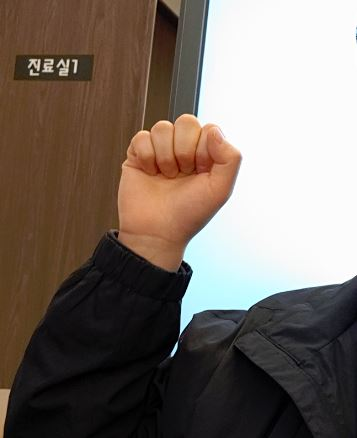
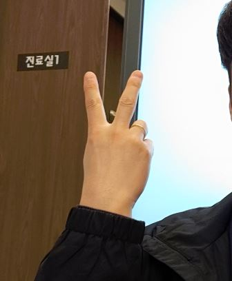
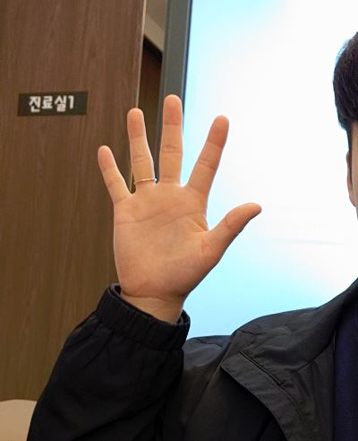
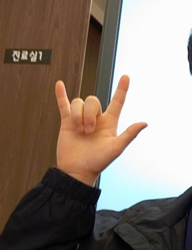

# Hand Sign Classification

다음의 총 7가지 손모양을 분류하는 모델을 만드는 과정을 정리한 문서입니다.

## 테스트 환경

- Linux Ubuntu 18.04
- tensorflow 2.1.0
- python 3.7.6

## 목차

- [Dataset](./dataset) 

- [Training](./training) 