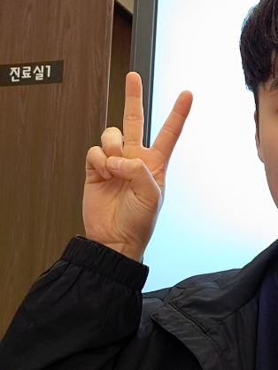

# Dataset

Dataset은 여러 배경에서 손 모양을 직접 촬영한 사진을 사용하였습니다.

총 7가지 손모양을 촬영하였으며 이미지와 레이블은 다음과 같습니다.

	0_front

	1_back

	1_front

	2_back

	2_front

	5_front

	ILU


## Dataset 분리

전체 사진은 각 class별로 약 250장이며 이중 50장은 검증용 나머지는 학습용으로 두었습니다.

테스트 데이터셋을 따로 두지 않은 이유는 데이터 수가 워낙 적은데다 모델의 성능은 OpenCV를 통해 실시간으로 받는 이미지를 대상으로 평가할 계획이었기 때문입니다.

따라서 다음과 같이 directory를 구성하였습니다.

분리에 사용한 코드는 `./split_datasets.ipynb`에 있습니다.

```
train/
	0_front
	1_back
	1_front
	2_back
	2_front
	5_front
	ILU
val/
	0_front
	1_back
	1_front
	2_back
	2_front
	5_front
	ILU
```

