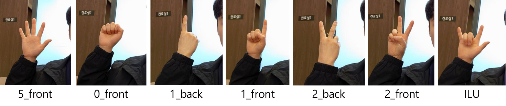

# Dataset
Dataset은 팀원들과 함께 여러 배경에서 직접 손을 촬영하며 수집하였다.

총 7가지 손모양을 촬영하였으며 이미지와 레이블은 다음과 같다.




## [1. Dataset Preparation](./dataset_preparation.ipynb)

전체 dataset은 다음과 같이 촬영한 배경별로 총 5개의 directory로 나누었다.

```
hand_1/
	0_front
	1_back
	1_front
	2_back
	2_front
	5_front
	ILU
hand_2/
	0_front
	1_back
	1_front
	2_back
	2_front
	5_front
	ILU
hand_3/
	0_front
	1_back
	1_front
	2_back
	2_front
	5_front
	ILU
hand_4/
	0_front
	1_back
	1_front
	2_back
	2_front
	5_front
	ILU
hand_5/
	0_front
	1_back
	1_front
	2_back
	2_front
	5_front
	ILU
```

그리고 각 directory마다(배경마다) 동일한 비율로 dataset을 아래와 같이 train, val로 분리하였다.

```
train/
	0_front
	1_back
	1_front
	2_back
	2_front
	5_front
	ILU
val/
	0_front
	1_back
	1_front
	2_back
	2_front
	5_front
	ILU
```

여기서, 테스트 데이터셋을 따로 두지 않은 이유는 다음과 같다.
1. Data의 수가 적음(각 class별 1000장 미만)
2. 최종 모델의 성능 평가는 직접 실시간 영상 이미지에 대한 동작 테스트로 대체할 수 있음

## [2. Augment and Resize data](./augment_and_resize_data.ipynb)

Data의 수가 적으므로, keras의 ImageDataGenerator를 사용해 한 이미지당 5장의 추가 이미지를 생성하였다. Augmentation에는 width & height shift, rotation, zoom, brightness의 transformation을 적용하였다.

Genetrator를 이용해 training시에 augmentation을 수행하지 않고 disk에 저장한 이유는 병목이 발생해 GPU Utilization이 20%정도밖에 되지 않았기 때문이다.

또한, 이 과정에서 image의 resizing도 같이 수행하였는데, 그 이유는 training시 data를 main memory에 올릴 때의 시간을 단축하기 위해서이다.

