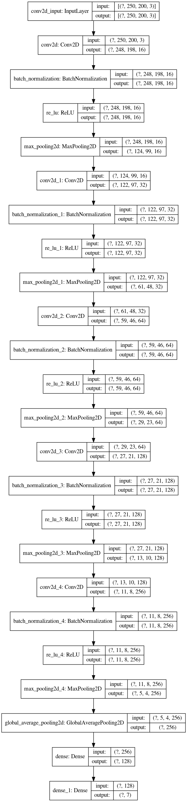
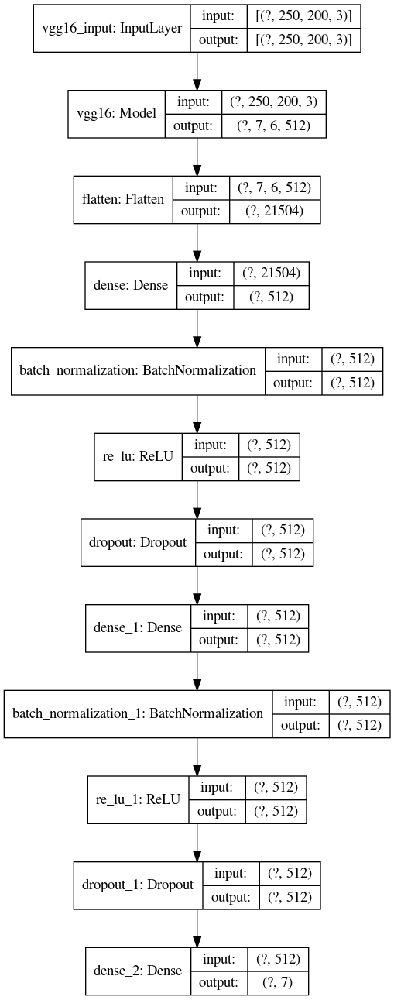
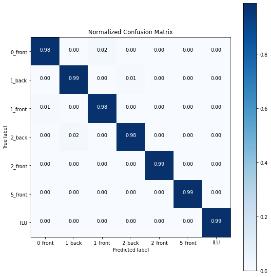
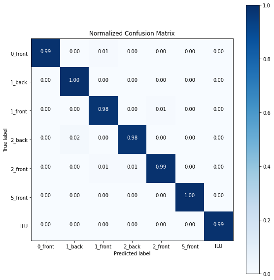

# Training

## [1. Simple CNN Model](./simple_cnn.ipynb)

Keras를 사용해 간단한 CNN 모델을 training 하였다.

학습한 모델 구조는 다음과 같다.

## 2. Fine Tune Pre-trained Model : VGG16

학습 데이터가 적으므로, Fine tuning을 수행하였다.

여기서는 Imagenet dataset에 학습된 VGG16 모델을 사용하였다. VGG16을 사용한 이유는 첫 분류기 학습 시 Xception, ResNet 등에 비해 성능이 좋았기 때문이다.

### [2-1. Feature Extraction](./vgg16_feature_extraction.ipynb)

VGG16 모델을 불러와 동결(`trainable=False`)시킨 후, VGG16 모델의 출력을 입력으로 받는 마지막 Fully Connected Layer(분류기)를 학습시킨다.

### [2-2. Fine Tuning](./vgg16_fine_tuning.ipynb)

동결 시킨 VGG16 모델의 마지막 Convolution Block(Convolution layer 4개)을 동결 해제시킨 후 분류기와 함께 재 학습

학습한 전체 모델 구조는 다음과 같다.

## 3. Model Selection

앞서 학습시킨 두 모델의 confusion matrix는 다음과 같다.

**Simple CNN Model**

**Fine Tune Pre-trained Model : VGG16**

Fine tuning 모델의 성능이 조금 더 좋기는 하지만 모델의 크기가 너무 커서 실시간 영상 이미지에서 테스트 시 속도가 저하되는 문제가 있었다.

따라서, 단순한 cnn 모델을 사용하기로 하였다.

## [4. Train all data](./train_all_data.ipynb)

앞서 구현한 Simple CNN 모델에 train, validation data 모두를 학습시킨다.